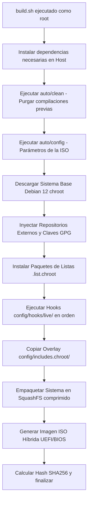

# Manual de Compilación e Integración — ProtoSec OS

Esta guía describe detalladamente los pasos requeridos para compilar y generar la imagen ISO híbrida oficial de **ProtoSec OS** utilizando la herramienta estándar industrial `live-build` de Debian. 

El proceso compila un sistema de archivos raíz completo, descarga paquetes oficiales y de repositorios externos, inyecta temas personalizados y scripts de control, y empaqueta el resultado en una imagen ISO híbrida booteable en entornos BIOS Legacy y UEFI.

---

## 🏗️ 1. Requisitos del Sistema Anfitrión (Host)

Dado que `live-build` requiere privilegios de superusuario (`root`), acceso al kernel del sistema para montar directorios virtuales (`/proc`, `/sys`, `/dev`) y un entorno de virtualización ligera (`chroot`), la compilación **debe realizarse obligatoriamente sobre un sistema anfitrión con Debian 12 Bookworm (amd64)**.

### Requisitos de Hardware
- **Procesador**: CPU de 64 bits con al menos 4 núcleos (se utiliza compresión paralela multihilo para SquashFS).
- **Memoria RAM**: 8 GB mínimos (se recomiendan 16 GB para acelerar la creación de imágenes y el almacenamiento en caché de apt).
- **Espacio en Disco**: Mínimo **40 GB libres** en una partición con soporte de atributos de Linux (Ext4, Btrfs o XFS). *No compiles sobre NTFS o exFAT.*
- **Conexión a Internet**: Conexión de banda ancha estable (se descargarán entre 4 GB y 6 GB de paquetes y dependencias).

---

## 🔧 2. Preparación del Entorno

Antes de clonar el repositorio e iniciar la compilación, instala los paquetes esenciales requeridos por el sistema de construcción de Debian en tu sistema host:

```bash
# Actualizar el sistema anfitrión
sudo apt-get update && sudo apt-get upgrade -y

# Instalar dependencias de live-build y empaquetamiento
sudo apt-get install -y live-build debootstrap squashfs-tools xorriso \
                        git curl wget gnupg dpkg-dev python3 python3-pip
```

---

## 📂 3. Estructura y Flujo de Compilación

El proyecto se organiza bajo la estructura estricta de `live-build` adaptada para ProtoSec OS:

```text
protosec-build/
├── build.sh                 # Script maestro de compilación (inicializa, limpia, compila)
├── auto/                    # Scripts de envoltura y configuración automática
│   ├── config               # Configuración avanzada de la arquitectura e ISO
│   ├── build                # Lanza lb build y canaliza logs a build.log
│   └── clean                # Limpia de forma segura cachés y estados intermedios
└── config/                  # Definiciones del sistema final
    ├── package-lists/       # Listados (.list.chroot) de paquetes Debian a instalar
    ├── hooks/live/          # Scripts Bash ejecutados dentro de chroot al compilar
    └── includes.chroot/     # Estructura de directorios copiada directamente a la ISO
```

### Flujo de Ejecución de la Compilación
Cuando ejecutas el comando `sudo ./build.sh`, se produce la siguiente secuencia lógica:



---

## 🚀 4. Proceso de Compilación Paso a Paso

1.  **Copiar el Repositorio**: Copia los archivos del código fuente de ProtoSec OS a tu máquina de compilación (ej. `/usr/local/src/protosec-os`).
2.  **Asignar Permisos**: Asegúrate de que todos los scripts del sistema de automatización y de construcción tienen permisos de ejecución activados:
    ```bash
    cd /usr/local/src/protosec-os
    sudo chmod +x build.sh auto/config auto/build auto/clean config/hooks/live/*
    ```
3.  **Ejecutar la Construcción**: Inicia el script principal:
    ```bash
    sudo ./build.sh
    ```
4.  **Monitorear los Logs**: Puedes abrir otra consola y monitorizar el progreso detallado leyendo el fichero de log en tiempo real:
    ```bash
    tail -f build.log
    ```

---

## 🛠️ 5. Personalización Avanzada

### 5.1. Cómo Modificar las Listas de Paquetes
Para añadir o eliminar herramientas nativas de Debian, edita los archivos ubicados en `config/package-lists/`:
- **`base.list.chroot`**: Utilidades esenciales de terminal y controladores de hardware.
- **`desktop.list.chroot`**: Componentes visuales, KDE Plasma y programas gráficos comunes.
- **`pentesting.list.chroot`**: Herramientas nativas del repositorio Debian o Kali para auditoría.
- **`databases.list.chroot`**: Servidores y herramientas CLI de bases de datos.
- **`server.list.chroot`**: Paquetes de servidor web, proxy, VPN y utilidades DevOps.

> [!TIP]
> Escribe únicamente un nombre de paquete por línea. Evita incluir dependencias directas que se resuelven automáticamente.

### 5.2. Cómo Añadir Hooks de Personalización
Los hooks son scripts de Bash ejecutados de forma secuencial dentro del entorno seguro `chroot` del sistema en construcción. Se almacenan en `config/hooks/live/` y deben seguir la nomenclatura `00XX-nombre.hook.chroot`.

Al escribir un hook nuevo:
- Comienza siempre con el shebang: `#!/usr/bin/env bash`
- Asegura que exporta variables necesarias, como `export DEBIAN_FRONTEND=noninteractive`.
- Si descargas ficheros externos, limpia las descargas temporales antes de que termine el script para reducir el tamaño final de la ISO.

---

## 🔍 6. Solución de Problemas (Troubleshooting)

### Error: `Space limit exceeded` o falta de espacio en disco
- **Causa**: `live-build` mantiene una copia completa del sistema sin comprimir y las cachés de paquetes APT, requiriendo más de 30 GB durante el proceso.
- **Solución**: Limpia espacio en disco y ejecuta una limpieza profunda antes de reintentar:
  ```bash
  sudo ./auto/clean
  ```

### Error: `GPG error: The following signatures couldn't be verified`
- **Causa**: Un repositorio secundario configurado en `config/archives/` no tiene su correspondiente clave pública GPG instalada en el llavero de APT del chroot.
- **Solución**: Asegúrate de que descargas e instalas la clave `.gpg` correcta dentro de `config/hooks/live/0010-base-setup.hook.chroot` y la mueves a `/usr/share/keyrings/` antes de realizar operaciones `apt-get update`.

### Error: `dpkg: error processing package [...]`
- **Causa**: Conflicto de dependencias en `chroot` o paquete no disponible para la arquitectura anfitriona `amd64`.
- **Solución**: Revisa el archivo `build.log` para encontrar qué paquete falló y verifica si su nombre ha cambiado en Debian Bookworm stable. Puedes comprobar su existencia en [Debian Packages Search](https://packages.debian.org/index).
